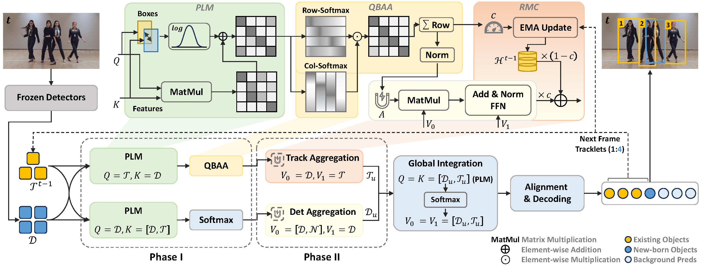

# PI-MOT: Physically-Guided Interaction Regularization for Multi-Object Tracking

This repository contains the official PyTorch implementation of the paper:
**"PI-MOT: Physically-Guided Interaction Regularization for Multi-Object Tracking"**.

---

## 1. Introduction

Tracking-by-query (TBQ) has emerged as an end-to-end paradigm for Multi-Object Tracking (MOT). However, existing TBQ trackers typically rely on affinity-driven attention for query interactions. Under severe occlusion and dense scenes, relying solely on semantic affinity can propagate degraded visual signals, violating the physical constraints required for reliable identity association.

To resolve these issues, **PI-MOT** reformulates query interaction as a constraint-aware information routing process through three lightweight, differentiable regularization mechanisms:
1. **Proximity-Guided Logit Modulation (PLM)**: Encourages spatially plausible interactions and suppresses long-range, physically implausible associations.
2. **Quasi-Bijective Attentional Alignment (QBAA)**: Mitigates ambiguous many-to-one competition by promoting exclusive query-to-observation associations.
3. **Reliability-Guided Memory Compensation (RMC)**: Quantifies observation reliability to adaptively balance current observations and historical track states during occlusion.

---

## 2. Overall Architecture

<div align="center">
  
</div>

---

## 3. Main Results

Our method achieves competitive performance on several challenging MOT benchmarks without using external video data for trajectory synthesis.

### DanceTrack Test Set
| Method | HOTA | DetA | AssA | MOTA | IDF1 |
| :--- | :---: | :---: | :---: | :---: | :---: |
| **PI-MOT** | **70.7** | **83.3** | **60.1** | **92.4** | **74.0** |

### SportsMOT Test Set
| Training Setting | HOTA | DetA | AssA | MOTA | IDF1 |
| :--- | :---: | :---: | :---: | :---: | :---: |
| **Setting I** *(train)* | **75.0** | **87.4** | **64.5** | **95.3** | **75.8** |
| **Setting II** *(train+val)* | **77.0** | **89.2** | **66.6** | **97.0** | **77.6** |

### MOT20 Test Set
| Method | HOTA | MOTA | IDF1 | FP | FN | IDSW |
| :--- | :---: | :---: | :---: | :---: | :---: | :---: |
| **PI-MOT** | **62.5** | **73.8** | **76.6** | **25,717** | **108,792** | **1,147** |

---

## 4. Environment Setup

We recommend installing PyTorch and Torchvision beforehand (matching your CUDA version), and then installing the rest of the dependencies via `requirements.txt`.

```bash
# 1. Create conda environment
conda create -n pimot python=3.8 -y
conda activate pimot

# 2. Install PyTorch matching your hardware (e.g., CUDA 11.8)
pip install torch==2.0.0+cu118 torchvision==0.15.1+cu118 --extra-index-url https://download.pytorch.org/whl/cu118

# 3. Install other dependencies
pip install -r requirements.txt
```

## 5. Data Preparation

Please download the datasets [DanceTrack](https://github.com/DanceTrack/DanceTrack), [SportsMOT](https://github.com/MCG-NJU/SportsMOT), [MOT20](https://huggingface.co/datasets/Lekim89/MOT20/tree/main), and organize them as follows:

```bash
<DATA_ROOT>/
├── DanceTrack/
│   ├── train/
│   ├── val/
│   ├── test/
│   └── val_seqmap.txt
├── SportsMOT/
│   ├── train/
│   ├── val/
│   ├── test/
│   └── val_seqmap.txt
└── MOT20/
    ├── train/
    ├── test/
    └── train_seqmap.txt
```

## 6. Training and Evaluation

Our training and inference protocols build on top of the TBDQ-Net framework.

### Training

To train the model on 2 GPUs (e.g., RTX 4090) for DanceTrack:

```bash
./tools/train.sh ./configs/motr-dab-yolox.args
```

### Evalution

To evaluate the model on the validation set, or take inference on the test set:

```bash
./tools/test.sh
```

## 7. Acknowledgments

This repository is built upon several great open-source projects. We thank the authors of:

[CO-MOT](https://github.com/IDEA-Research/DAB-DETR)

[DAB-DETR](https://github.com/IDEA-Research/DAB-DETR)

[Deep-OC-SORT](https://github.com/GerardMaggiolino/Deep-OC-SORT)

[ByteTrack](https://github.com/FoundationVision/ByteTrack)